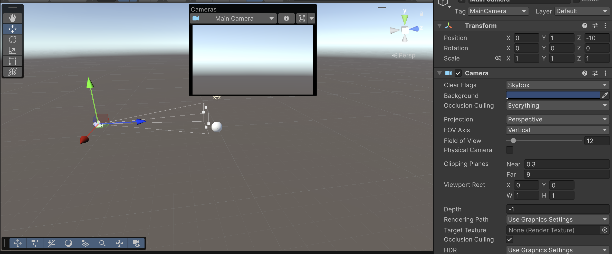

# Seminario Mundos Virtuales. Introducción a la programación de gráficos 3D.
En este seminario vamos a responder a 15 preguntas, relacionando en los casos que sea posible con los contenidos que se han explicado en la sesión de mundos virtuales.

## Integrantes del grupo
- Igor Dragone - alu0101469652@ull.edu.es 
- Álvaro Fontenla León - alu0101437989@ull.edu.es
- Sergio Pérez Lozano - alu0101473260@ull.edu.es
- Juan Rodríguez Suárez - alu0101477596@ull.edu.es

## Preguntas

### 1. Qué funciones se pueden usar en los scripts de Unity para llevar a cabo traslaciones, rotaciones y escalados.
Se usan métodos y funciones de las clases Transform y RigidBody:
- Para traslaciones tenemos `transform.position`, que permite acceder o asignar directamente una nueva posición en el espacio 3D, `transform.Translate(Vector3)`, que mueve el objeto una distancia específica en la dirección indicada por el vector y finalmente `Rigidbody.MovePosition(Vector3)`, para objetos físicos.
- Para rotaciones tenemos `transform.rotation`, que permite establecer la rotación del objeto directamente mediante un Quaternion, `transform.Rotate(Vector3)`, que aplica una rotación adicional en los ejes X, Y y Z relativos al objeto y `Rigidbody.MoveRotation(Quaternion)`, para objetos físicos. También existe `transform.RotateAround(Vector3 point, Vector3 axis, float angle)`, donde el objeto rota alrededor de un punto específico.
- Para escalados tenemos `transform.localScale`, que permite ajustar la escala del objeto en los ejes X, Y y Z

Todos estos métodos modifican el sistema de referencia del objeto al que se le aplican, multiplicando cada vértice por la matriz de transformación.
### 2. Como trasladarías la cámara 2 metros en cada uno de los ejes y luego la rotas 30º alrededor del eje Y?. Rota la cámara alrededor del eje Y 30ª y desplázala 2 metros en cada uno de los ejes. ¿Obtendrías el mismo resultado en ambos casos?. Justifica el resultado
En primer lugar vamos a mover la cámara:
- Para trasladarla 2 metros en cada uno de los ejes usamos transform.Translate(2,2,2)
- Para rotar 30 grados alrededor del eje Y usamos transform.Rotate(0,30,0)

En el segundo caso realizamos las mismas operaciones pero en orden invertido. Sin embargo, el resultado que obtendríamos no sería el mismo: al rotar primero, los ejes locales del objeto cambiarán, luego al desplazar el objeto, la posición final no coincidirá con la del primer caso.
### 3. Sitúa la esfera de radio 1 en el campo de visión de la cámara y configura un volumen de vista que la recorte parcialmente.
Para realizar este ejercicio, primero creamos una esfera de radio 1 (desde GameObject). En segundo lugar, nos colocamos en la cámara y modificamos el ángulo de apertura o FOV, pasando del valor 60 a 12. De esta forma, la esfera se ve parcialmente recortada:

### 4.Sitúa la esfera de radio 1 en el campo de visión de la cámara y configura el volumen de vista para que la deje fuera de la vista.
Esta vez, para que la esfera se quede fuera de la vista, modificamos el atributo far de la cámara, pasando de 1000 a 9. Dado que la esfera está a una distancia de 10, esta no aparecerá en la vitsa aún estando en el campo de visión de la cámara:

### 5. Como puedes aumentar el ángulo de la cámara. Qué efecto tiene disminuir el ángulo de la cámara.
### 6. Es correcta la siguiente afirmación: Para realizar la proyección al espacio 2D, en el inspector de la cámara, cambiaremos el valor de projection, asignándole el valor de orthographic
### 7. Especifica las rotaciones que se han indicado en los ejercicios previos con la utilidad quaternion.
### 8. ¿Como puedes averiguar la matriz de proyección en perspectiva que se ha usado para proyectar la escena al último frame renderizado?.
### 9. ¿Como puedes averiguar la matriz de proyección en perspectiva ortográfica que se ha usado para proyectar la escena al último frame renderizado?.
### 10. ¿Cómo puedes obtener la matriz de transformación entre el sistema de coordenadas local y el mundial?.
### 11. Cómo puedes obtener la matriz para cambiar al sistema de referencia de vista
### 12. Especifica la matriz de la proyección usado en un instante de la ejecución del ejercicio 1 de la práctica 1.
### 13. Especifica la matriz de modelo y vista de la escena del ejercicio 1 de la práctica 1.
### 14. Aplica una rotación en el start de uno de los objetos de la escena y muestra la matriz de cambio al sistema de referencias mundial.
### 15. ¿Como puedes calcular las coordenadas del sistema de referencia de un objeto con las siguientes propiedades del Transform:?: Position (3, 1, 1), Rotation (45, 0, 45)
